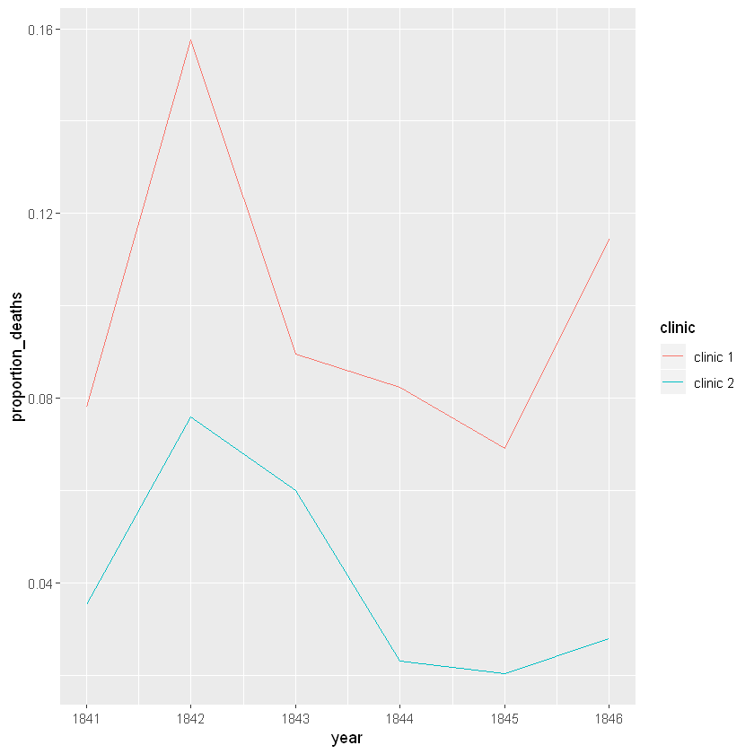
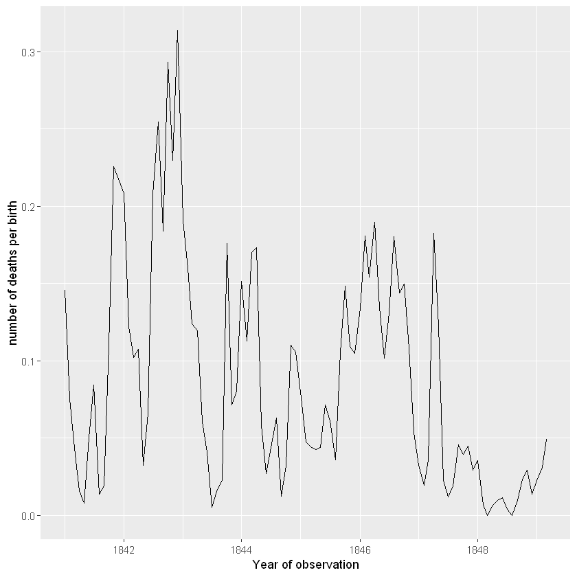
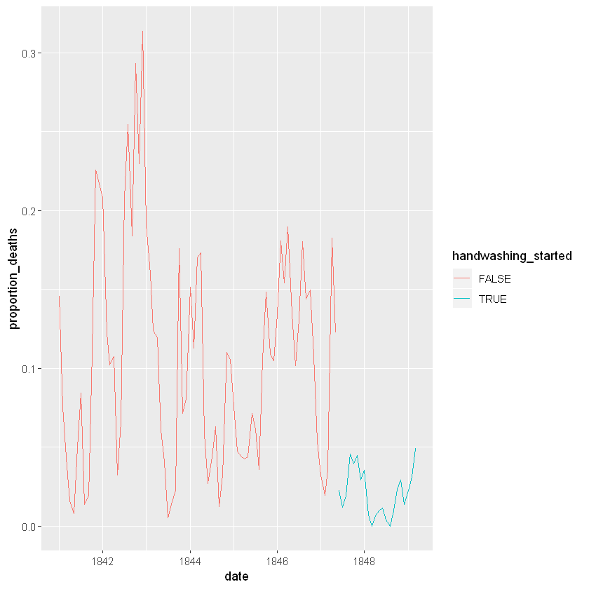

```R
library(dplyr)
```

    
    Attaching package: 'dplyr'
    
    The following objects are masked from 'package:stats':
    
        filter, lag
    
    The following objects are masked from 'package:base':
    
        intersect, setdiff, setequal, union
    
    


```R
library(tidyverse)
```

    Registered S3 methods overwritten by 'ggplot2':
      method         from 
      [.quosures     rlang
      c.quosures     rlang
      print.quosures rlang
    Registered S3 method overwritten by 'rvest':
      method            from
      read_xml.response xml2
    -- Attaching packages --------------------------------------- tidyverse 1.2.1 --
    v ggplot2 3.1.1     v readr   1.3.1
    v tibble  2.1.1     v purrr   0.3.2
    v tidyr   0.8.3     v stringr 1.4.0
    v ggplot2 3.1.1     v forcats 0.4.0
    -- Conflicts ------------------------------------------ tidyverse_conflicts() --
    x dplyr::filter() masks stats::filter()
    x dplyr::lag()    masks stats::lag()
    


```R
library(tidyr)
```


```R
monthly <- read.csv("data/monthly_deaths.csv")
monthly
```


<table>
<thead><tr><th scope=col>date</th><th scope=col>births</th><th scope=col>deaths</th></tr></thead>
<tbody>
	<tr><td>1841-01-01</td><td>254       </td><td>37        </td></tr>
	<tr><td>1841-02-01</td><td>239       </td><td>18        </td></tr>
	<tr><td>1841-03-01</td><td>277       </td><td>12        </td></tr>
	<tr><td>1841-04-01</td><td>255       </td><td> 4        </td></tr>
	<tr><td>1841-05-01</td><td>255       </td><td> 2        </td></tr>
	<tr><td>1841-06-01</td><td>200       </td><td>10        </td></tr>
	<tr><td>1841-07-01</td><td>190       </td><td>16        </td></tr>
	<tr><td>1841-08-01</td><td>222       </td><td> 3        </td></tr>
	<tr><td>1841-09-01</td><td>213       </td><td> 4        </td></tr>
	<tr><td>1841-10-01</td><td>236       </td><td>26        </td></tr>
	<tr><td>1841-11-01</td><td>235       </td><td>53        </td></tr>
	<tr><td>1842-01-01</td><td>307       </td><td>64        </td></tr>
	<tr><td>1842-02-01</td><td>311       </td><td>38        </td></tr>
	<tr><td>1842-03-01</td><td>264       </td><td>27        </td></tr>
	<tr><td>1842-04-01</td><td>242       </td><td>26        </td></tr>
	<tr><td>1842-05-01</td><td>310       </td><td>10        </td></tr>
	<tr><td>1842-06-01</td><td>273       </td><td>18        </td></tr>
	<tr><td>1842-07-01</td><td>231       </td><td>48        </td></tr>
	<tr><td>1842-08-01</td><td>216       </td><td>55        </td></tr>
	<tr><td>1842-09-01</td><td>223       </td><td>41        </td></tr>
	<tr><td>1842-10-01</td><td>242       </td><td>71        </td></tr>
	<tr><td>1842-11-01</td><td>209       </td><td>48        </td></tr>
	<tr><td>1842-12-01</td><td>239       </td><td>75        </td></tr>
	<tr><td>1843-01-01</td><td>272       </td><td>52        </td></tr>
	<tr><td>1843-02-01</td><td>263       </td><td>42        </td></tr>
	<tr><td>1843-03-01</td><td>266       </td><td>33        </td></tr>
	<tr><td>1843-04-01</td><td>285       </td><td>34        </td></tr>
	<tr><td>1843-05-01</td><td>246       </td><td>15        </td></tr>
	<tr><td>1843-06-01</td><td>196       </td><td> 8        </td></tr>
	<tr><td>1843-07-01</td><td>191       </td><td> 1        </td></tr>
	<tr><td>...</td><td>...</td><td>...</td></tr>
	<tr><td>1846-10-01</td><td>254       </td><td>38        </td></tr>
	<tr><td>1846-11-01</td><td>297       </td><td>32        </td></tr>
	<tr><td>1846-12-01</td><td>298       </td><td>16        </td></tr>
	<tr><td>1847-01-01</td><td>311       </td><td>10        </td></tr>
	<tr><td>1847-02-01</td><td>312       </td><td> 6        </td></tr>
	<tr><td>1847-03-01</td><td>305       </td><td>11        </td></tr>
	<tr><td>1847-04-01</td><td>312       </td><td>57        </td></tr>
	<tr><td>1847-05-01</td><td>294       </td><td>36        </td></tr>
	<tr><td>1847-06-01</td><td>268       </td><td> 6        </td></tr>
	<tr><td>1847-07-01</td><td>250       </td><td> 3        </td></tr>
	<tr><td>1847-08-01</td><td>264       </td><td> 5        </td></tr>
	<tr><td>1847-09-01</td><td>262       </td><td>12        </td></tr>
	<tr><td>1847-10-01</td><td>278       </td><td>11        </td></tr>
	<tr><td>1847-11-01</td><td>246       </td><td>11        </td></tr>
	<tr><td>1847-12-01</td><td>273       </td><td> 8        </td></tr>
	<tr><td>1848-01-01</td><td>283       </td><td>10        </td></tr>
	<tr><td>1848-02-01</td><td>291       </td><td> 2        </td></tr>
	<tr><td>1848-03-01</td><td>276       </td><td> 0        </td></tr>
	<tr><td>1848-04-01</td><td>305       </td><td> 2        </td></tr>
	<tr><td>1848-05-01</td><td>313       </td><td> 3        </td></tr>
	<tr><td>1848-06-01</td><td>264       </td><td> 3        </td></tr>
	<tr><td>1848-07-01</td><td>269       </td><td> 1        </td></tr>
	<tr><td>1848-08-01</td><td>261       </td><td> 0        </td></tr>
	<tr><td>1848-09-01</td><td>312       </td><td> 3        </td></tr>
	<tr><td>1848-10-01</td><td>299       </td><td> 7        </td></tr>
	<tr><td>1848-11-01</td><td>310       </td><td> 9        </td></tr>
	<tr><td>1848-12-01</td><td>373       </td><td> 5        </td></tr>
	<tr><td>1849-01-01</td><td>403       </td><td> 9        </td></tr>
	<tr><td>1849-02-01</td><td>389       </td><td>12        </td></tr>
	<tr><td>1849-03-01</td><td>406       </td><td>20        </td></tr>
</tbody>
</table>


```R
yearly <- read.csv("data/yearly_deaths_by_clinic.csv")
yearly
```


<table>
<thead><tr><th scope=col>year</th><th scope=col>births</th><th scope=col>deaths</th><th scope=col>clinic</th></tr></thead>
<tbody>
	<tr><td>1841    </td><td>3036    </td><td>237     </td><td>clinic 1</td></tr>
	<tr><td>1842    </td><td>3287    </td><td>518     </td><td>clinic 1</td></tr>
	<tr><td>1843    </td><td>3060    </td><td>274     </td><td>clinic 1</td></tr>
	<tr><td>1844    </td><td>3157    </td><td>260     </td><td>clinic 1</td></tr>
	<tr><td>1845    </td><td>3492    </td><td>241     </td><td>clinic 1</td></tr>
	<tr><td>1846    </td><td>4010    </td><td>459     </td><td>clinic 1</td></tr>
	<tr><td>1841    </td><td>2442    </td><td> 86     </td><td>clinic 2</td></tr>
	<tr><td>1842    </td><td>2659    </td><td>202     </td><td>clinic 2</td></tr>
	<tr><td>1843    </td><td>2739    </td><td>164     </td><td>clinic 2</td></tr>
	<tr><td>1844    </td><td>2956    </td><td> 68     </td><td>clinic 2</td></tr>
	<tr><td>1845    </td><td>3241    </td><td> 66     </td><td>clinic 2</td></tr>
	<tr><td>1846    </td><td>3754    </td><td>105     </td><td>clinic 2</td></tr>
</tbody>
</table>


```R
yearly <- yearly %>%
mutate("proportion_deaths" = deaths/births)
yearly

```


<table>
<thead><tr><th scope=col>year</th><th scope=col>births</th><th scope=col>deaths</th><th scope=col>clinic</th><th scope=col>proportion_deaths</th></tr></thead>
<tbody>
	<tr><td>1841      </td><td>3036      </td><td>237       </td><td>clinic 1  </td><td>0.07806324</td></tr>
	<tr><td>1842      </td><td>3287      </td><td>518       </td><td>clinic 1  </td><td>0.15759051</td></tr>
	<tr><td>1843      </td><td>3060      </td><td>274       </td><td>clinic 1  </td><td>0.08954248</td></tr>
	<tr><td>1844      </td><td>3157      </td><td>260       </td><td>clinic 1  </td><td>0.08235667</td></tr>
	<tr><td>1845      </td><td>3492      </td><td>241       </td><td>clinic 1  </td><td>0.06901489</td></tr>
	<tr><td>1846      </td><td>4010      </td><td>459       </td><td>clinic 1  </td><td>0.11446384</td></tr>
	<tr><td>1841      </td><td>2442      </td><td> 86       </td><td>clinic 2  </td><td>0.03521704</td></tr>
	<tr><td>1842      </td><td>2659      </td><td>202       </td><td>clinic 2  </td><td>0.07596841</td></tr>
	<tr><td>1843      </td><td>2739      </td><td>164       </td><td>clinic 2  </td><td>0.05987587</td></tr>
	<tr><td>1844      </td><td>2956      </td><td> 68       </td><td>clinic 2  </td><td>0.02300406</td></tr>
	<tr><td>1845      </td><td>3241      </td><td> 66       </td><td>clinic 2  </td><td>0.02036409</td></tr>
	<tr><td>1846      </td><td>3754      </td><td>105       </td><td>clinic 2  </td><td>0.02797017</td></tr>
</tbody>
</table>


```R
ggplot(yearly, aes(x = year, y = proportion_deaths, colour = clinic)) +
geom_line()
```


    

    


```R

```


<table>
<thead><tr><th scope=col>date</th><th scope=col>births</th><th scope=col>deaths</th></tr></thead>
<tbody>
	<tr><td>1841-01-01</td><td>254       </td><td>37        </td></tr>
	<tr><td>1841-02-01</td><td>239       </td><td>18        </td></tr>
	<tr><td>1841-03-01</td><td>277       </td><td>12        </td></tr>
	<tr><td>1841-04-01</td><td>255       </td><td> 4        </td></tr>
	<tr><td>1841-05-01</td><td>255       </td><td> 2        </td></tr>
	<tr><td>1841-06-01</td><td>200       </td><td>10        </td></tr>
	<tr><td>1841-07-01</td><td>190       </td><td>16        </td></tr>
	<tr><td>1841-08-01</td><td>222       </td><td> 3        </td></tr>
	<tr><td>1841-09-01</td><td>213       </td><td> 4        </td></tr>
	<tr><td>1841-10-01</td><td>236       </td><td>26        </td></tr>
	<tr><td>1841-11-01</td><td>235       </td><td>53        </td></tr>
	<tr><td>1842-01-01</td><td>307       </td><td>64        </td></tr>
	<tr><td>1842-02-01</td><td>311       </td><td>38        </td></tr>
	<tr><td>1842-03-01</td><td>264       </td><td>27        </td></tr>
	<tr><td>1842-04-01</td><td>242       </td><td>26        </td></tr>
	<tr><td>1842-05-01</td><td>310       </td><td>10        </td></tr>
	<tr><td>1842-06-01</td><td>273       </td><td>18        </td></tr>
	<tr><td>1842-07-01</td><td>231       </td><td>48        </td></tr>
	<tr><td>1842-08-01</td><td>216       </td><td>55        </td></tr>
	<tr><td>1842-09-01</td><td>223       </td><td>41        </td></tr>
	<tr><td>1842-10-01</td><td>242       </td><td>71        </td></tr>
	<tr><td>1842-11-01</td><td>209       </td><td>48        </td></tr>
	<tr><td>1842-12-01</td><td>239       </td><td>75        </td></tr>
	<tr><td>1843-01-01</td><td>272       </td><td>52        </td></tr>
	<tr><td>1843-02-01</td><td>263       </td><td>42        </td></tr>
	<tr><td>1843-03-01</td><td>266       </td><td>33        </td></tr>
	<tr><td>1843-04-01</td><td>285       </td><td>34        </td></tr>
	<tr><td>1843-05-01</td><td>246       </td><td>15        </td></tr>
	<tr><td>1843-06-01</td><td>196       </td><td> 8        </td></tr>
	<tr><td>1843-07-01</td><td>191       </td><td> 1        </td></tr>
	<tr><td>...</td><td>...</td><td>...</td></tr>
	<tr><td>1846-10-01</td><td>254       </td><td>38        </td></tr>
	<tr><td>1846-11-01</td><td>297       </td><td>32        </td></tr>
	<tr><td>1846-12-01</td><td>298       </td><td>16        </td></tr>
	<tr><td>1847-01-01</td><td>311       </td><td>10        </td></tr>
	<tr><td>1847-02-01</td><td>312       </td><td> 6        </td></tr>
	<tr><td>1847-03-01</td><td>305       </td><td>11        </td></tr>
	<tr><td>1847-04-01</td><td>312       </td><td>57        </td></tr>
	<tr><td>1847-05-01</td><td>294       </td><td>36        </td></tr>
	<tr><td>1847-06-01</td><td>268       </td><td> 6        </td></tr>
	<tr><td>1847-07-01</td><td>250       </td><td> 3        </td></tr>
	<tr><td>1847-08-01</td><td>264       </td><td> 5        </td></tr>
	<tr><td>1847-09-01</td><td>262       </td><td>12        </td></tr>
	<tr><td>1847-10-01</td><td>278       </td><td>11        </td></tr>
	<tr><td>1847-11-01</td><td>246       </td><td>11        </td></tr>
	<tr><td>1847-12-01</td><td>273       </td><td> 8        </td></tr>
	<tr><td>1848-01-01</td><td>283       </td><td>10        </td></tr>
	<tr><td>1848-02-01</td><td>291       </td><td> 2        </td></tr>
	<tr><td>1848-03-01</td><td>276       </td><td> 0        </td></tr>
	<tr><td>1848-04-01</td><td>305       </td><td> 2        </td></tr>
	<tr><td>1848-05-01</td><td>313       </td><td> 3        </td></tr>
	<tr><td>1848-06-01</td><td>264       </td><td> 3        </td></tr>
	<tr><td>1848-07-01</td><td>269       </td><td> 1        </td></tr>
	<tr><td>1848-08-01</td><td>261       </td><td> 0        </td></tr>
	<tr><td>1848-09-01</td><td>312       </td><td> 3        </td></tr>
	<tr><td>1848-10-01</td><td>299       </td><td> 7        </td></tr>
	<tr><td>1848-11-01</td><td>310       </td><td> 9        </td></tr>
	<tr><td>1848-12-01</td><td>373       </td><td> 5        </td></tr>
	<tr><td>1849-01-01</td><td>403       </td><td> 9        </td></tr>
	<tr><td>1849-02-01</td><td>389       </td><td>12        </td></tr>
	<tr><td>1849-03-01</td><td>406       </td><td>20        </td></tr>
</tbody>
</table>


```R
monthly <- monthly %>%
mutate("proportion_deaths" = deaths/births)
monthly
```


<table>
<thead><tr><th scope=col>date</th><th scope=col>births</th><th scope=col>deaths</th><th scope=col>proportion_deaths</th></tr></thead>
<tbody>
	<tr><td>1841-01-01 </td><td>254        </td><td>37         </td><td>0.145669291</td></tr>
	<tr><td>1841-02-01 </td><td>239        </td><td>18         </td><td>0.075313808</td></tr>
	<tr><td>1841-03-01 </td><td>277        </td><td>12         </td><td>0.043321300</td></tr>
	<tr><td>1841-04-01 </td><td>255        </td><td> 4         </td><td>0.015686275</td></tr>
	<tr><td>1841-05-01 </td><td>255        </td><td> 2         </td><td>0.007843137</td></tr>
	<tr><td>1841-06-01 </td><td>200        </td><td>10         </td><td>0.050000000</td></tr>
	<tr><td>1841-07-01 </td><td>190        </td><td>16         </td><td>0.084210526</td></tr>
	<tr><td>1841-08-01 </td><td>222        </td><td> 3         </td><td>0.013513514</td></tr>
	<tr><td>1841-09-01 </td><td>213        </td><td> 4         </td><td>0.018779343</td></tr>
	<tr><td>1841-10-01 </td><td>236        </td><td>26         </td><td>0.110169492</td></tr>
	<tr><td>1841-11-01 </td><td>235        </td><td>53         </td><td>0.225531915</td></tr>
	<tr><td>1842-01-01 </td><td>307        </td><td>64         </td><td>0.208469055</td></tr>
	<tr><td>1842-02-01 </td><td>311        </td><td>38         </td><td>0.122186495</td></tr>
	<tr><td>1842-03-01 </td><td>264        </td><td>27         </td><td>0.102272727</td></tr>
	<tr><td>1842-04-01 </td><td>242        </td><td>26         </td><td>0.107438017</td></tr>
	<tr><td>1842-05-01 </td><td>310        </td><td>10         </td><td>0.032258065</td></tr>
	<tr><td>1842-06-01 </td><td>273        </td><td>18         </td><td>0.065934066</td></tr>
	<tr><td>1842-07-01 </td><td>231        </td><td>48         </td><td>0.207792208</td></tr>
	<tr><td>1842-08-01 </td><td>216        </td><td>55         </td><td>0.254629630</td></tr>
	<tr><td>1842-09-01 </td><td>223        </td><td>41         </td><td>0.183856502</td></tr>
	<tr><td>1842-10-01 </td><td>242        </td><td>71         </td><td>0.293388430</td></tr>
	<tr><td>1842-11-01 </td><td>209        </td><td>48         </td><td>0.229665072</td></tr>
	<tr><td>1842-12-01 </td><td>239        </td><td>75         </td><td>0.313807531</td></tr>
	<tr><td>1843-01-01 </td><td>272        </td><td>52         </td><td>0.191176471</td></tr>
	<tr><td>1843-02-01 </td><td>263        </td><td>42         </td><td>0.159695817</td></tr>
	<tr><td>1843-03-01 </td><td>266        </td><td>33         </td><td>0.124060150</td></tr>
	<tr><td>1843-04-01 </td><td>285        </td><td>34         </td><td>0.119298246</td></tr>
	<tr><td>1843-05-01 </td><td>246        </td><td>15         </td><td>0.060975610</td></tr>
	<tr><td>1843-06-01 </td><td>196        </td><td> 8         </td><td>0.040816327</td></tr>
	<tr><td>1843-07-01 </td><td>191        </td><td> 1         </td><td>0.005235602</td></tr>
	<tr><td>...</td><td>...</td><td>...</td><td>...</td></tr>
	<tr><td>1846-10-01 </td><td>254        </td><td>38         </td><td>0.149606299</td></tr>
	<tr><td>1846-11-01 </td><td>297        </td><td>32         </td><td>0.107744108</td></tr>
	<tr><td>1846-12-01 </td><td>298        </td><td>16         </td><td>0.053691275</td></tr>
	<tr><td>1847-01-01 </td><td>311        </td><td>10         </td><td>0.032154341</td></tr>
	<tr><td>1847-02-01 </td><td>312        </td><td> 6         </td><td>0.019230769</td></tr>
	<tr><td>1847-03-01 </td><td>305        </td><td>11         </td><td>0.036065574</td></tr>
	<tr><td>1847-04-01 </td><td>312        </td><td>57         </td><td>0.182692308</td></tr>
	<tr><td>1847-05-01 </td><td>294        </td><td>36         </td><td>0.122448980</td></tr>
	<tr><td>1847-06-01 </td><td>268        </td><td> 6         </td><td>0.022388060</td></tr>
	<tr><td>1847-07-01 </td><td>250        </td><td> 3         </td><td>0.012000000</td></tr>
	<tr><td>1847-08-01 </td><td>264        </td><td> 5         </td><td>0.018939394</td></tr>
	<tr><td>1847-09-01 </td><td>262        </td><td>12         </td><td>0.045801527</td></tr>
	<tr><td>1847-10-01 </td><td>278        </td><td>11         </td><td>0.039568345</td></tr>
	<tr><td>1847-11-01 </td><td>246        </td><td>11         </td><td>0.044715447</td></tr>
	<tr><td>1847-12-01 </td><td>273        </td><td> 8         </td><td>0.029304029</td></tr>
	<tr><td>1848-01-01 </td><td>283        </td><td>10         </td><td>0.035335689</td></tr>
	<tr><td>1848-02-01 </td><td>291        </td><td> 2         </td><td>0.006872852</td></tr>
	<tr><td>1848-03-01 </td><td>276        </td><td> 0         </td><td>0.000000000</td></tr>
	<tr><td>1848-04-01 </td><td>305        </td><td> 2         </td><td>0.006557377</td></tr>
	<tr><td>1848-05-01 </td><td>313        </td><td> 3         </td><td>0.009584665</td></tr>
	<tr><td>1848-06-01 </td><td>264        </td><td> 3         </td><td>0.011363636</td></tr>
	<tr><td>1848-07-01 </td><td>269        </td><td> 1         </td><td>0.003717472</td></tr>
	<tr><td>1848-08-01 </td><td>261        </td><td> 0         </td><td>0.000000000</td></tr>
	<tr><td>1848-09-01 </td><td>312        </td><td> 3         </td><td>0.009615385</td></tr>
	<tr><td>1848-10-01 </td><td>299        </td><td> 7         </td><td>0.023411371</td></tr>
	<tr><td>1848-11-01 </td><td>310        </td><td> 9         </td><td>0.029032258</td></tr>
	<tr><td>1848-12-01 </td><td>373        </td><td> 5         </td><td>0.013404826</td></tr>
	<tr><td>1849-01-01 </td><td>403        </td><td> 9         </td><td>0.022332506</td></tr>
	<tr><td>1849-02-01 </td><td>389        </td><td>12         </td><td>0.030848329</td></tr>
	<tr><td>1849-03-01 </td><td>406        </td><td>20         </td><td>0.049261084</td></tr>
</tbody>
</table>


```R
head(monthly)
```


<table>
<thead><tr><th scope=col>date</th><th scope=col>births</th><th scope=col>deaths</th><th scope=col>proportion_deaths</th></tr></thead>
<tbody>
	<tr><td>1841-01-01 </td><td>254        </td><td>37         </td><td>0.145669291</td></tr>
	<tr><td>1841-02-01 </td><td>239        </td><td>18         </td><td>0.075313808</td></tr>
	<tr><td>1841-03-01 </td><td>277        </td><td>12         </td><td>0.043321300</td></tr>
	<tr><td>1841-04-01 </td><td>255        </td><td> 4         </td><td>0.015686275</td></tr>
	<tr><td>1841-05-01 </td><td>255        </td><td> 2         </td><td>0.007843137</td></tr>
	<tr><td>1841-06-01 </td><td>200        </td><td>10         </td><td>0.050000000</td></tr>
</tbody>
</table>


```R
monthly$date <- as.Date(as.character(monthly$date))
```


```R

ggplot(monthly,aes(x = date, y = proportion_deaths)) +
geom_line() +
labs(x = "Year of observation", y = "number of deaths per birth") +
geom_path()

```


    

    


```R
handwashing_start = as.Date('1847-06-01')
monthly <- monthly %>%
mutate(handwashing_started = date >= handwashing_start)
ggplot(monthly, aes(x = date, y = proportion_deaths, color = handwashing_started)) +
geom_line()
```


    

    


```R
monthly_summary <- monthly %>%
group_by(handwashing_started)%>%
summarise(mean(proportion_deaths))
monthly_summary
```


<table>
<thead><tr><th scope=col>handwashing_started</th><th scope=col>mean(proportion_deaths)</th></tr></thead>
<tbody>
	<tr><td>FALSE     </td><td>0.10504998</td></tr>
	<tr><td> TRUE     </td><td>0.02109338</td></tr>
</tbody>
</table>


```R
test <- t.test(proportion_deaths ~ handwashing_started, data = monthly)
test
```


    
    	Welch Two Sample t-test
    
    data:  proportion_deaths by handwashing_started
    t = 9.6101, df = 92.435, p-value = 1.445e-15
    alternative hypothesis: true difference in means is not equal to 0
    95 percent confidence interval:
     0.06660662 0.10130659
    sample estimates:
    mean in group FALSE  mean in group TRUE 
             0.10504998          0.02109338 
    


```R
doctors_should_wash_their_hands <- TRUE
```


```R

```
